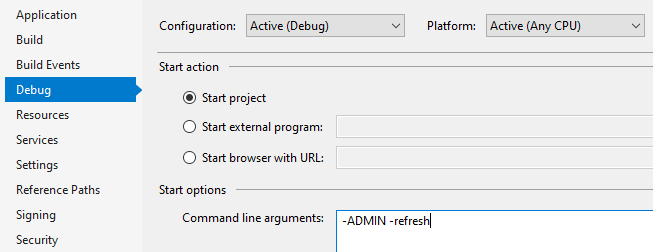

# About

Simple example for detecting command line arguments and react.

In this case results are written to the Output window for Visual Studio.

Here are two arguments we test for.



**Usage**
```csharp
private void Form1_Shown(object sender, System.EventArgs e)
{
    if (!ApplicationHelper.HasCommandLineArguments) return;

    Console.WriteLine(ApplicationHelper.AdminMode ? "Admin mode" : "Normal mode");
    Console.WriteLine(ApplicationHelper.Refresh ? "Refresh" : "Do not refresh");
}
```

**Class**
```csharp
using System;
using System.Linq;

namespace CommandLineArguments
{
    public class ApplicationHelper
    {
        /// <summary>
        /// Property to get command arguments minus argument 0 which is the
        /// path and executable name
        /// </summary>
        /// <returns>Command arguments if present</returns>
        public static string[] CommandLineArguments
        {
            get
            {
                var arguments = Environment.GetCommandLineArgs().
                    ToList().Select((arg) => arg.ToUpper()).
                    ToList();

                arguments.RemoveAt(0);
                return arguments.ToArray();
            }
        }

        public static bool AdminMode => HasCommandLineArguments && CommandLineArguments.Contains("-ADMIN");
        public static bool Refresh => HasCommandLineArguments && CommandLineArguments.Contains("-REFRESH");

        /// <summary>
        /// Used to get command argument count
        /// </summary>
        /// <returns>Count of command arguments sent on startup of application</returns>
        public static bool HasCommandLineArguments => CommandLineArguments.Length > 0;
    }
}
```