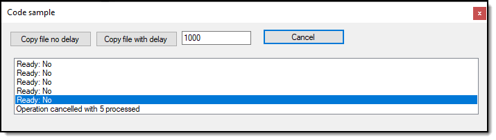

# About

Code sample to detect when a file copy has completed. Has cancel operation and some delays to simulate a larger file then used here.

**Note** This is done in a windows form project but can be done in just about any type of project with minor changes.

- Check file is ready in [FileHelper class](https://github.com/karenpayneoregon/code-samples-csharp/blob/master/CopyFileWhenDone/Classes/FileHelper.cs).
- Copy file from external source code in [FileOperations class](https://github.com/karenpayneoregon/code-samples-csharp/blob/master/CopyFileWhenDone/Classes/FileOperations.cs).

# Requires

Project named [WindFormControls](https://github.com/karenpayneoregon/code-samples-csharp/tree/master/WinFormControls) in this repository for a numeric text box.