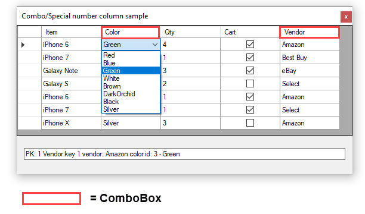

# About

Code sample for using DataGridViewComboBox and custom numeric DataGridView column.

> Note, for real life application the item (phone type) should work with the color and vendor properties e.g. if iPhone 6 is selected the color and vendor should change dependent on what the vendor has in stock.

## Before running

> Run databasescript.sql

### Screenshot

