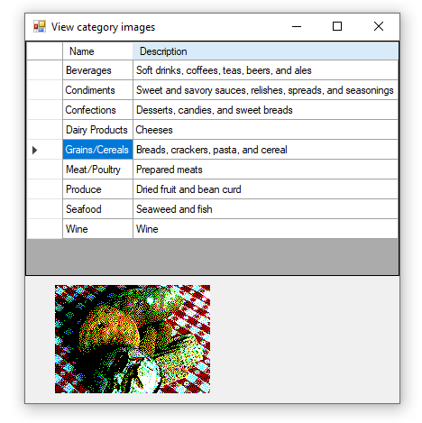

# About


Demostrates reading images from a SQL-Server database table using Entity Framework Core.

## Notes
Although this is done with EF Core, the focus is on a byte array. When asking EF Core to get an image a byte array is returned and if using a SqlConnection coupled with a SqlCommand using a SELECT WHERE as shown below a byte array is returned. So focus should be placed on converting the byte array to (in this case) to an Image,

```sql
SELECT Picture FROM dbo.Categories WHERE dbo.Categories.CategoryID = 1;
```

- So either Entity Framework Core or conventional read the following method provides a suitable image for (in this case) loading a PictureBox.
- InvalidImage is a method in the same class as ByteArrayToImage which creates a read background image with white text indicating an error. Alternate solution is to pass back null which will show a picture box with no image.

```csharp
public static Image ByteArrayToImage(byte[] contents)
{
    if (contents is null)
    {
        return InvalidImage(); // or return null
    }
    else
    {
        var converter = new ImageConverter();
        var image = (Image)converter.ConvertFrom(contents);

        return image;
    }
}
```

