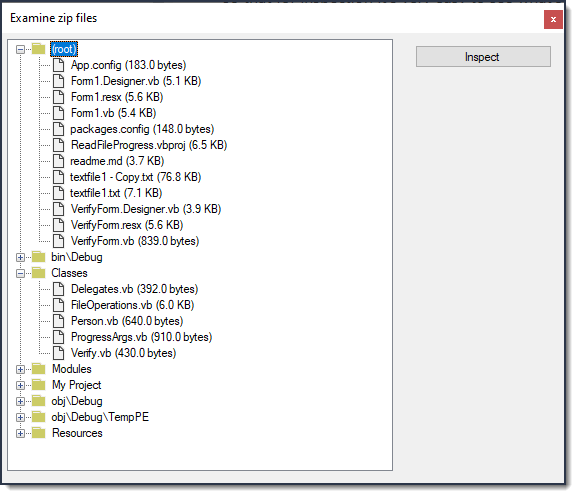

# About

Code sample to get all folder and files in a .zip file. For visuals a TreeView is used.



- If there are folders in folders they are shown separately, close enough to similar nodes so that for inspection it's very easy to see what's in the .zip file.
- Exception handling is done via an event in the worker class where the form subscribes to the event.

### Extract with Git

Create a temp folder, create a batch file, add the following and run.

```batch
mkdir code
cd code
git init
git remote add -f origin https://github.com/karenpayneoregon/code-samples-csharp
git sparse-checkout init --cone
git sparse-checkout add ExamineZipFile
git pull origin master
:clean-up
del .gitattributes
del .gitignore
del .yml
del .editorconfig
del *.md
del *.sln
```
