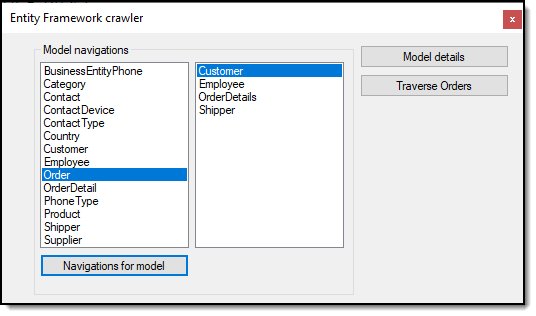

# About 

This project and the class project [NorthWindForEntityFramework6](https://github.com/karenpayneoregon/code-samples-csharp/tree/master/NorthWindForEntityFramework6) provide the ground work for digging into Entity Framework models and their details. No attempts made to create graphics.

- There are various gems not uncovered here but by taking time to review presented code and inspecting various items there is a good deal to be extracted.
- Some details are shown in the form while other details in Visual Studio's output window.
- No attempts/testing against various versions of Entity Framework, only tested with EF 6 code first with existing database.

For developers looking to get in the ground floor of working with models at runtime this will provide a decent foundation.

### Notes

There are tools out there if this is not what is desired.

### How to extract 
Since there are 50 plus projects and no visual way to download two project, create a temp folder, create a batch file with the following and execute. Requires a fairly current version of Git for the commands to work.

```batch
mkdir code
cd code
git init
git remote add -f origin https://github.com/karenpayneoregon/code-samples-csharp
git sparse-checkout init --cone
git sparse-checkout add NorthWindForEntityFramework6
git sparse-checkout add NorthWindForEntityFrameworkFrontEnt6
git pull origin master
:clean-up
del .gitattributes
del .gitignore
del .yml
del .editorconfig
del *.md
del *.sln
```

