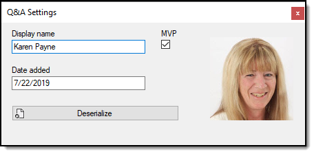

# About

Experiment for obtaining Q&A personal data.



# Clone

- Create batch file in a temp folder
- Place the following in the batch file.
- Run batch file to download project.

```batch
mkdir code
cd code
git init
git remote add -f origin https://github.com/karenpayneoregon/code-samples-csharp
git sparse-checkout init --cone
git sparse-checkout add PersonalData
git pull origin master
:clean-up
del .gitattributes
del .gitignore
del .yml
del .editorconfig
del *.md
del *.sln
```