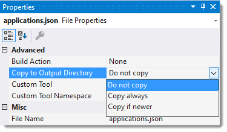
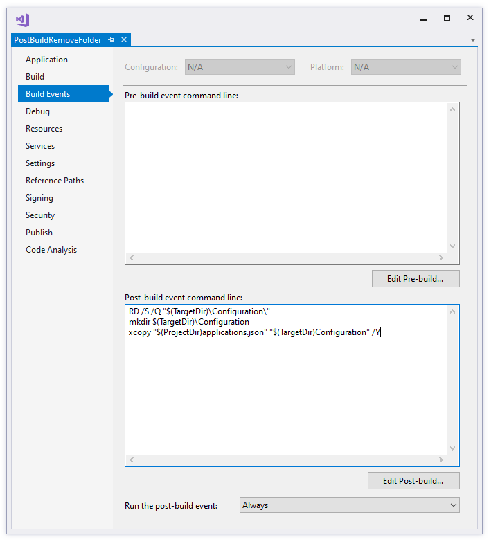
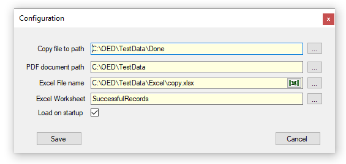

# About

-  Requires Newtonsoft.Json NuGet package to read the json file.
Shows how to remove a folder, create a folder and finally copy a file into that folder in the project post build event.
- Start XCOPY rather than XCOPY can be used to get around a permissions issue which prevented copying.

The conventional option is done under properties, *Copy to Output Directory* but there may be time this does not suit a developers requirements.

Another idea is to use a Post Build event as shown below.

In this project the folder Configuration is first removed which removes any files (this will fail if a file is in use) followed by copying applications.json to the newly creae Configuration folder.

This only happens inside Visual Studio, not outside of Visual Studio so it's solely for development in this case.

> The *Run the post-build event* is set to *Always* so it happens on each run of the project which may or may not be what a developer wants so change it as desired.

To prove the json file exists the following screen displays data read from the json configuration file while the buttons on the right of each TextBox do nothing.

