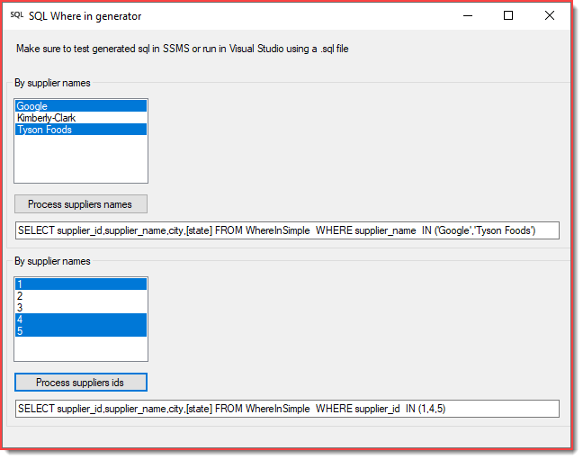

# About 

This project shows how to create an SQL SELECT WHERE IN statement for strings and int. Currently the backend code supports Microsoft SQL-Server while for other databases needs modification as per comments in SqlGenerator.CreateWhereStatement().

An easier way might be to use string concatenation while in this case one must 
consider apostrophes when dealing with strings e.g. Daniel O<kbd>'</kbd>Neal with string concatenation and no concern for apostrophes will be a problem at runtime and an exception will be thrown. 

# Sample database

There is a code sample which generates dynamic parameters which requires script.sql to run which generates a modified NorthWind database in this project.

# Requires

- The following [class project](https://github.com/karenpayneoregon/code-samples-csharp/tree/master/SqlHelperLibrary)
- Framework 4.7.2 but will work with later and some earlier versions of the .NET Framework.

# Download

Create a temp folder e.g. C:\DotNet\GitTemp and create a batch file, place the following in the batch file and run. This will download the two projects needed which can then be copied into a Visual Studio solution then delete the folder C:\DotNet\GitTemp. The reason for this way to download as there are currently 52 projects in the repository and GitHub does not have a visual method to download single or multiple projects. 

```batch
mkdir code
cd code
git init
git remote add -f origin https://github.com/karenpayneoregon/code-samples-csharp
git sparse-checkout init --cone
git sparse-checkout add SqlDynamicGenerator
git sparse-checkout add SqlHelperLibrary
git pull origin master
:clean-up
del .gitattributes
del .gitignore
del .yml
del .editorconfig
del *.md
del *.sln
```


