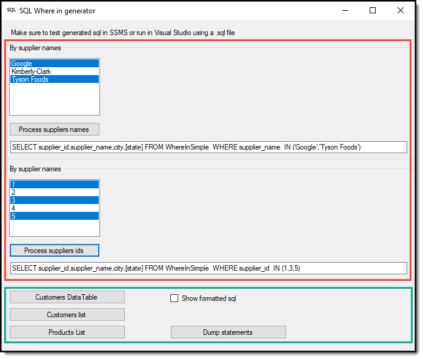

# About

Contains code for dynamically creating SQL SELECT WHERE IN statements.

[Frontend project](https://github.com/karenpayneoregon/code-samples-csharp/tree/master/SqlDynamicGenerator) is a Windows Form project, think of it as a new fangled console project. All code in this class project is not dependent on Window forms.

In the screenshot below, the red creates SQL WHERE IN without parameters while the green area creates SQL WHERE IN with parameters. Best to always use parameters for both security and also ensuring data types are properly formatted for the backend database.



### Example call

```csharp
var customers = Mocked.ExampleCustomersList1(new List<string>()
{
    "Assistant Sales Agent",
    "Owner"
});
```

**Input SQL**

```csharp
var selectStatement =
    "SELECT C.CustomerIdentifier , C.CompanyName , C.ContactName , C.ContactTypeIdentifier , " +
    "FORMAT(C.ModifiedDate, 'MM-dd-yyyy', 'en-US') AS ModifiedDate, CT.ContactTitle " +
    "FROM dbo.Customers AS C INNER JOIN dbo.ContactType AS CT ON C.ContactTypeIdentifier = CT.ContactTypeIdentifier " +
    $"WHERE {parameterPrefix} IN ({{0}}) ORDER BY C.CompanyName";
```

**Results**

```sql
SELECT C.CustomerIdentifier,
       C.CompanyName,
       C.ContactName,
       C.ContactTypeIdentifier,
       FORMAT(C.ModifiedDate, 'MM-dd-yyyy', 'en-US') AS ModifiedDate,
       CT.ContactTitle
FROM dbo.Customers AS C
     INNER JOIN
     dbo.ContactType AS CT
     ON C.ContactTypeIdentifier = CT.ContactTypeIdentifier
WHERE CT.ContactTitle IN (@CTContactTitle0, @CTContactTitle1)
ORDER BY C.CompanyName;
```


# Requires

**NuGet package** Microsoft.SqlServer.TransactSql.ScriptDom for pretty formatting SQL only.

# Important notes

* Currently setup for SQL-Server, to use for other databases alter the switch statement in SqlGenerator.CreateWhereStatement
* Requires script.sql to run for demo code samples to run from the project SqlDynamicGenerator.

# Extracting from this repository

Using Git create a temp folder e.g. C:\Dotnet\Temp, create a batch file with the following and execute to download. Make sure to have the lastest version of Git installed.

```batch
mkdir code
cd code
git init
git remote add -f origin https://github.com/karenpayneoregon/code-samples-csharp
git sparse-checkout init --cone
git sparse-checkout add SqlDynamicGenerator
git sparse-checkout add SqlHelperLibrary
git pull origin master
:clean-up
del .gitattributes
del .gitignore
del .yml
del .editorconfig
del *.md
del *.sln
```
