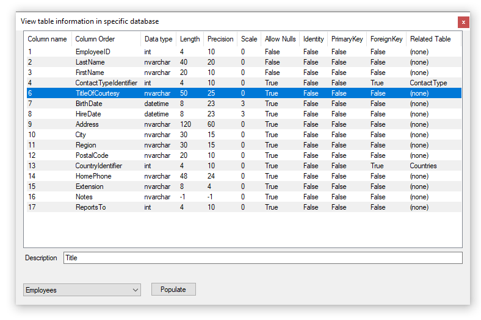
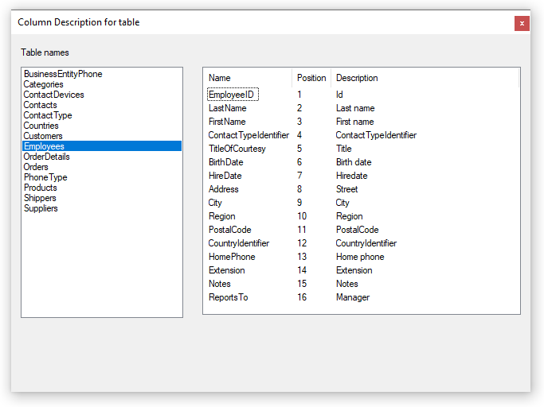
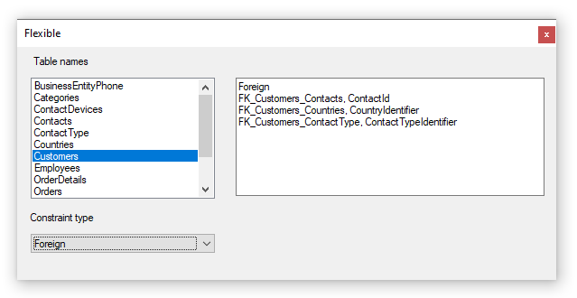

# About

Various examples for obtaining information from SQL-Server

- App.config needs attention, change the server and catalog name.
- Each form demonstrate different things, to change the startup form open Program.cs and change to the desired form name then build/run.
- No exception handling is used, each code sample is to be considered a developer helper and in turn the developer should be smart enough to ensure things like the database name exists and available etc.
- SMO is an alternate to using T-SQL

