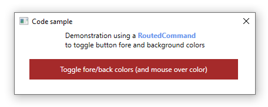

# About

Shows how to toggle fore/back colors for a button where the button is controlled using a RoutedCommand and mouse over via a button style. Most code samples on the web neglect to consider the mouse over color which this code sample handles.

