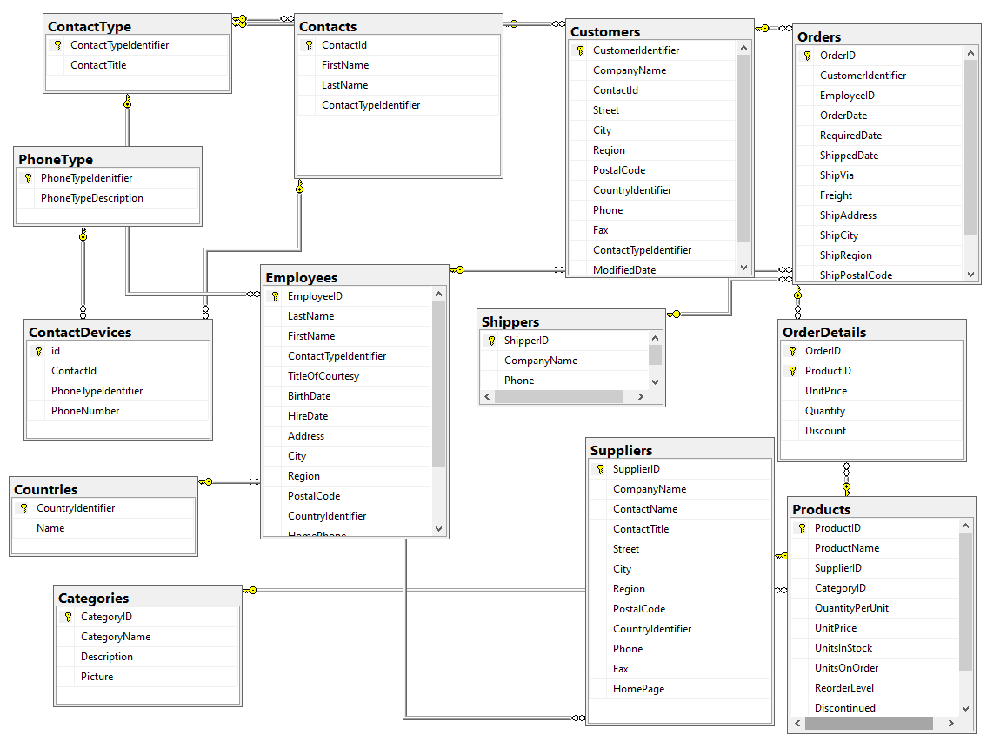

# About collection of C# code solutions

# Notes

- Code written using Framework 4.2 unless otherwise specified.
- SQL-Server database used for testing is a modified version of Microsoft NorthWind database found in the following [GitHub Gist](https://gist.github.com/karenpayneoregon/9bdf1a7d5310ac1d562b2326d79d6038) along with Microsoft AdventureWorks2012 database.
- Windows forms projects are used as they are easy to standup and with this code is not limited to Window Forms.

 